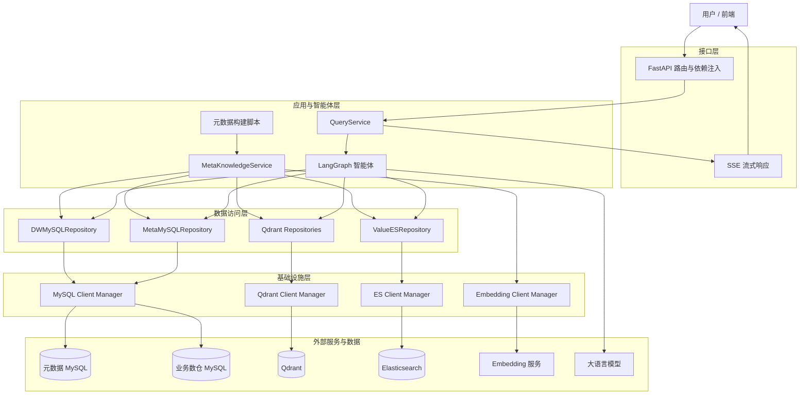
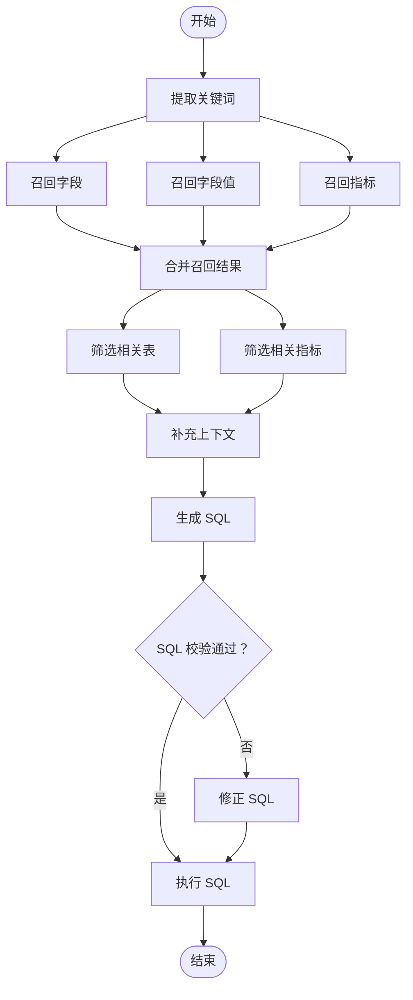

# Text2SQL Agent

一个面向中文数据分析场景的 Text-to-SQL 智能体服务。它会理解自然语言问题，结合业务元数据、字段和值的检索结果生成 SQL，校验并执行查询，并以 SSE 流式方式向调用方返回每个处理阶段和最终结果。

例如，输入“统计去年各地区的总销售额”，服务会识别指标、时间和地区等信息，生成针对数据仓库的查询并返回结果。

## 核心能力

- **自然语言转 SQL**：使用 LangGraph 编排多步骤智能体流程，调用大模型生成 SQL。
- **多路知识召回**：字段与指标通过 Qdrant 进行语义检索；枚举值通过 Elasticsearch 进行全文检索。
- **业务元数据驱动**：在 `conf/meta_config.yaml` 中声明表、字段、别名和指标，构建可检索的业务知识。
- **SQL 校验与纠错**：在执行前检查 SQL；校验失败时进入纠错流程。
- **异步服务与流式反馈**：基于 FastAPI、SQLAlchemy 异步会话和 Server-Sent Events（SSE），实时返回处理进度、错误或查询结果。

## 系统架构

项目采用四层架构：接口层负责接收请求并返回流式响应；应用与智能体层组织查询和知识构建流程；数据访问层封装不同存储的读写；基础设施层统一管理异步客户端及其生命周期。模型定义、配置和日志属于跨层支撑，不单独构成业务层。



其中，`MetaMySQLRepository` 对应项目维护的表、字段和指标元数据；`DWMySQLRepository` 对应待分析的真实业务数据。Qdrant 保存字段与指标的向量索引，Elasticsearch 保存可用于值召回的字段值；它们都不是“代码层”，而是基础设施层所连接的外部存储。

## 智能体流程

```text
用户问题
  → 关键词提取
  → 并行召回：字段 / 字段值 / 指标
  → 合并召回结果，筛选表与指标
  → 补充上下文，生成 SQL
  → 校验 SQL ──失败→ 修正 SQL
  → 执行 SQL，流式返回结果
```

以下为 LangGraph流程图，源文件见 [graph.mmd](graph.mmd)。



## 技术栈

| 类别 | 组件 | 用途 |
| --- | --- | --- |
| API 服务 | FastAPI、SSE | 提供异步流式查询接口 |
| 智能体 | LangChain、LangGraph、DeepSeek | 编排检索、生成、校验与执行流程 |
| 关系数据 | MySQL、SQLAlchemy、asyncmy | 存储元数据并执行数据仓库查询 |
| 向量检索 | Qdrant | 召回字段与指标的语义信息 |
| 全文检索 | Elasticsearch | 召回字段可能取值 |
| 向量化 | Hugging Face Text Embeddings Inference | 将文本转换为向量 |
| 配置与日志 | OmegaConf、Loguru | 管理 YAML 配置及任务级日志 |

## 前置条件

- Python 3.12+
- `uv`（推荐，用于安装与运行 Python 依赖）
- 可访问的 MySQL、Qdrant、Elasticsearch 与 Embedding 服务
- 可用的大模型 API 凭据

服务地址、数据库账号、索引名、Embedding 模型和模型凭据均在 `conf/app_config.yaml` 中配置。请按自己的环境修改其中的示例值；不要提交真实密码或 API Key。若当前配置文件中曾保存过真实密钥，请立即在对应平台撤销并换新。

## 快速开始

### 1. 安装依赖

在项目根目录执行：

```bash
uv sync
```

### 2. 配置基础服务

编辑 `conf/app_config.yaml`，至少确认以下服务可以连通：

- `db_meta`：存放业务元数据的 MySQL 数据库；
- `db_dw`：实际执行分析 SQL 的数据仓库；
- `qdrant`：向量数据库；
- `es`：Elasticsearch；
- `embedding`：Embedding 推理服务；
- `llm`：模型名称和 API Key。

然后在 `conf/meta_config.yaml` 中维护业务表、字段、同义词和指标。带有 `sync: true` 的字段会在构建知识时读取示例值，以支持值召回。

### 3. 构建元数据知识库

首次启动、修改 `meta_config.yaml` 或更新数仓样例值后，执行：

```bash
uv run python -m app.scripts.build_meta_knowledge -c conf/meta_config.yaml
```

该命令会把元数据写入 MySQL，将字段和指标写入 Qdrant，并将可召回的字段值建立到 Elasticsearch 中。

### 4. 启动后端服务

```bash
uv run fastapi dev main.py
```

默认访问地址为 `http://127.0.0.1:8000`。开发模式下可在 `http://127.0.0.1:8000/docs` 查看接口文档。

## 项目结构

```text
app/
├── agent/        # LangGraph 状态、上下文、节点与流程图
├── api/          # FastAPI 路由、依赖与请求模型
├── clients/      # MySQL、Qdrant、ES、Embedding 客户端管理
├── conf/         # YAML 配置加载与类型定义
├── repository/   # 各存储系统的数据访问层
├── scripts/      # 元数据知识构建脚本
└── service/      # 查询与元数据知识服务
conf/
├── app_config.yaml   # 服务连接、日志与模型配置
└── meta_config.yaml  # 表、字段、别名与指标定义
prompts/              # 智能体各节点使用的提示词
main.py               # FastAPI 应用入口
```

## 常见问题

- **启动后无法连接 MySQL 或收到 Embedding 502**：先确认依赖服务已完全启动并可访问，再启动本服务。
- **修改了表结构或别名但检索仍是旧结果**：重新运行“构建元数据知识库”命令。若需从头重建，请先在相应存储服务中清理旧数据。
- **生成的 SQL 不符合预期**：检查 `meta_config.yaml` 中的表、字段描述和别名，并视需要调整 `prompts/` 下的提示词。

## 相关项目

配套的 Web 界面见 [text2sql-agent-frontend](https://github.com/crippleboli/text2sql-agent-frontend)。
